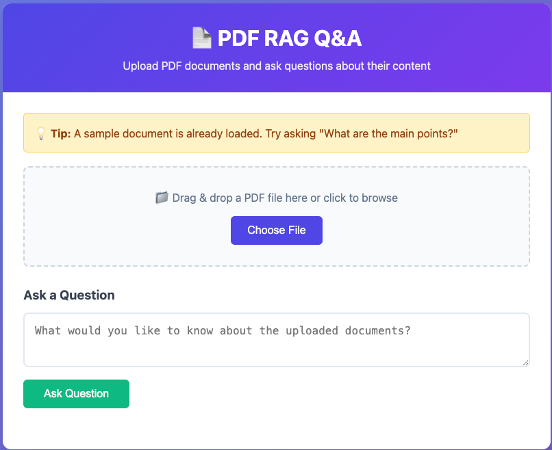

# PDF RAG LLM

A simple document Q&A system that lets you upload PDFs and ask questions about their content using AI.

## 🎯 Web Interface



**Features:**
- 📁 Drag & drop PDF upload
- 💬 Interactive Q&A interface
- 📊 Real-time status updates
- 🎨 Clean, modern design

**Access**: Open http://localhost:8000 in your browser after starting the services.

## 🚀 Quick Start

1. **Start the services:**
   ```bash
   docker-compose up --build -d
   ```

2. **Wait for the model to download** (first time only, ~2-3 minutes)

3. **Open the web interface:**
   ```bash
   open http://localhost:8000
   ```

4. **Try asking questions** (sample document pre-loaded):
   - "What are the main points?"
   - "What is the Ministry of Silly Walks?"
   - "What happened in the 1980s?"

## 📁 Project Structure

```
├── app/                   # Application code
│   ├── app.py            # FastAPI server
│   ├── static/           # Web UI files
│   │   └── index.html   # Web interface
│   ├── requirements.txt  # Python dependencies
│   └── Dockerfile        # App container
├── data/                 # Sample documents
│   └── fake_document.pdf # Sample PDF for testing
├── docker-compose.yml    # Service orchestration
├── Makefile             # Development commands
└── README.md            # This file
```

## 🔧 What's Included

- **FastAPI**: Web server with automatic API docs
- **Ollama**: Local LLM with `qwen2.5:0.5b` model preloaded
- **Document Processing**: Upload TXT, PDF, or MD files with PyPDF2 parsing
- **Simple RAG**: Keyword matching + LLM generation
- **Web UI**: Modern drag-and-drop interface

## 🌐 Access Points

- **Web Interface**: http://localhost:8000 (main UI)
- **API Documentation**: http://localhost:8000/docs (Swagger UI)
- **Health Check**: http://localhost:8000/health (system status)

## 📋 API Usage

### Upload Document
```bash
curl -X POST "http://localhost:8000/ingest" \
  -F "file=@data/fake_document.pdf" \
  -F "chunk_size=500" \
  -F "overlap=100"
```

### Ask Question
```bash
curl -X POST "http://localhost:8000/query" \
  -H "Content-Type: application/json" \
  -d '{
    "question": "What are the main points?",
    "top_k": 3,
    "temperature": 0.3
  }'
```

## 🛑 Stop Services
```bash
docker-compose down
```

## 🛠️ Docker Commands

```bash
# Start services
docker-compose up --build -d

# View logs
docker-compose logs -f

# Restart services
docker-compose restart

# Stop and remove containers
docker-compose down -v

# Rebuild and start
docker-compose up --build --force-recreate
```

## 📋 API Usage (Optional)

If you prefer using the API directly:

### Upload Document
```bash
curl -X POST "http://localhost:8000/ingest" \
  -F "file=@your-document.pdf" \
  -F "chunk_size=500" \
  -F "overlap=100"
```

### Ask Question
```bash
curl -X POST "http://localhost:8000/query" \
  -H "Content-Type: application/json" \
  -d '{
    "question": "What are the main points?",
    "top_k": 3,
    "temperature": 0.3
  }'
```

## 📝 Notes

- **First Run**: Downloads AI model automatically (~500MB)
- **Documents**: Stored in memory only (reset on restart)
- **File Support**: PDF, TXT, MD files up to 50MB
- **Retrieval**: Keyword matching (not vector embeddings)
- **Web UI**: Modern interface for easy interaction
- **Sample Data**: Pre-loaded with `fake_document.pdf` for testing

## 🎯 Getting Started Workflow

1. **Start**: `docker-compose up --build -d`
2. **Wait**: 2-3 minutes for model download
3. **Open**: http://localhost:8000
4. **Upload**: Drag & drop your PDF files
5. **Ask**: Type questions about your documents
6. **Get**: AI-powered answers based on content